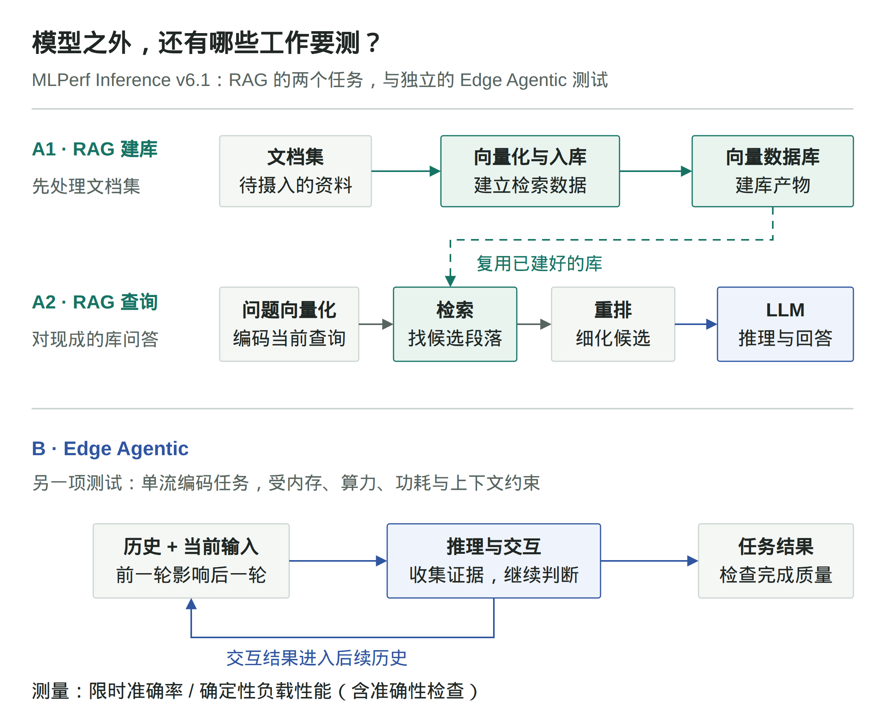
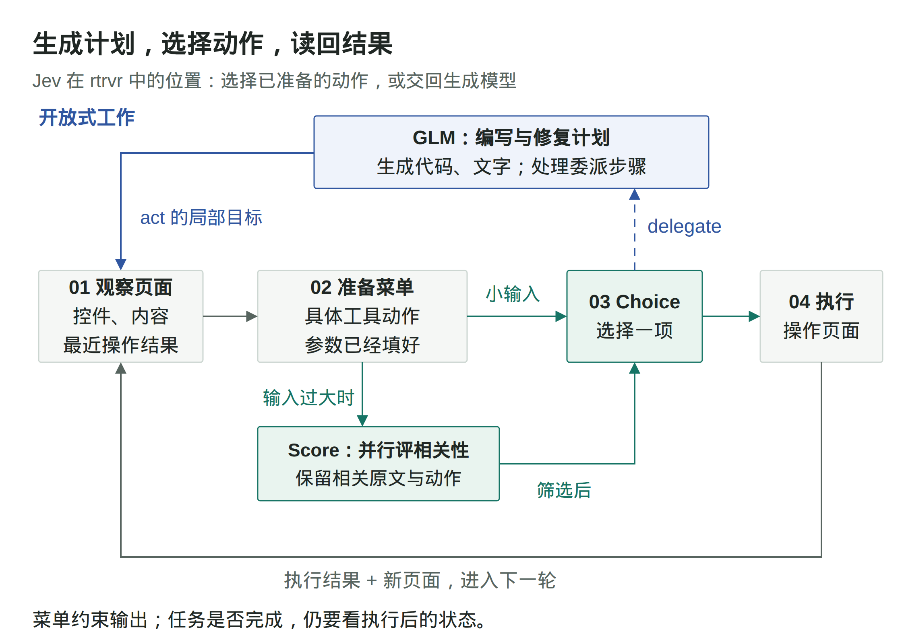

# Research 周报：2026 年 9 月 11 日至 9 月 17 日

本期选读营销分析、推理评测与模型研发，追踪 DSH 更新、共享模型安全，以及 Jev 的决策接口与浏览器集成；简讯关注并行工具调用的故障恢复和强化学习中的工具选择捷径。

## LangChain：营销周报的数字不可靠，问题可能在数据来源

原文：[How We Built LangChain's Paid Media Agent](https://www.langchain.com/blog/paid-media-agent) · 2026-09-13

一个营销 Agent 可以把广告支出、点击和销售机会整理成周报，但这些数字不一定能直接拼在一起。不同广告平台有不同的层级、标识和归因窗口，数据仓库里的关联关系也可能不完整。LangChain 的团队记录了一个具体错误：仓库通过关键词关联 Google 广告数据，视频广告却不一定有关键词，结果漏掉了约 10% 的 Google 支出。

他们没有要求模型从几套互相矛盾的数字里猜一个答案，而是明确每项指标由哪个系统负责。支出、展示和点击以广告平台为准；线索、销售机会和后续销售管道以仓库为准。相关规则写入业务 Wiki，并通过工具可见范围限制错误来源。无法可靠关联的数据保留缺口，同时说明来源、日期窗口和归因口径。

计算方式也发生了变化。早期版本把大量投放和销售记录交给模型，让它自己计算总量和环比，每次都可能重新走一遍计算过程。后来改由 Python 拉取数据、对齐日期、计算比较并执行固定规则，模型读取紧凑结果，负责解释原因和提出建议。哪些数据可信、数字怎样算，因而可以脱离语言生成单独检查。

在按平台分派子 Agent 之后，团队又遇到一个与模型能力无关的故障：两个子 Agent 共用报告路径和完成标记，第一个完成后，第二个可能误以为自己也完成了。修正办法是给各平台独立的产物位置和状态。单独的上下文窗口没有自动隔离文件和任务状态，这些仍要由运行系统定义。

报告之后的操作也没有直接交给模型执行。Agent 可以提出关键词、定向或广告活动的修改建议；服务端检查操作者身份，授权人员核对和批准最终方案，再由代码提交修改并回读广告平台确认结果。分析、审批和实际生效之间有可检查的交接。

这篇文章适合当作完整工作流的复盘来读：它既解释数据为什么会错，也记录产物丢失和权限边界的问题。作者同时报告了获客成本和营销管道的变化，但这期间预算、投放方式和团队工作都在变化，不能把这些业务结果全部归因于 Agent。文末提出的持续主动监测仍是后续方向，不应与当前的定时和按需运行混写。

## MLPerf 开始测完整流程：模型吐字快，为什么应用还会慢？

原文：[MLPerf Inference v6.1 官方发布说明](https://mlcommons.org/2026/09/mlperf-inference-v6-1-results/) · 2026-09-16

向知识库提一个问题，用户等待的是有依据的答案，不是某个模型生成第一个字。系统可能先查资料、筛选段落，最后才把材料交给大模型。即使最后一步变快，前面的等待仍然存在。MLPerf Inference v6.1 新增的端到端 RAG 与边缘 Agentic Inference 两项测试，关注的正是单次模型调用之外的工作。[1]

它们对应两种不同的性能问题：RAG 要测清多个处理阶段组合后的表现；Agent 多轮任务还要面对不断增长的历史，以及前一轮结果对后一轮工作的影响。两者不能画成一条流水线，也不能用一个模型的生成速度替代。

### 一次知识库问答，要先走完哪些步骤

以“某款设备能否在低温环境下工作”为教学例子，系统需要先从资料库找出相关规格，再组织答案。MLCommons 公告描述的 RAG 查询流程是：把问题转换成向量，用它从向量数据库找出候选段落，再由重排模型细化候选顺序，最后让一个或多个大模型依据材料推理并回答。[1]

这里的向量可以理解为供系统比较内容相关性的数值表示。检索先找到候选，重排再进一步筛选它们，大模型才有材料可用。仅仅计量大模型生成答案的速度，会漏掉前面的查询编码、检索与重排；如果等待主要发生在那里，换一个生成更快的模型，用户也未必会按同样比例更快拿到答案。

但“端到端”还需要说清起点。资料库不会凭空存在，文档得先被处理、写入向量数据库。v6.1 为此分开测量两项任务：**把文档集摄入并建库**，以及**对已经建好的库执行查询问答**。第二项不是每来一个问题，就把整个资料库重建一次。[1]

这个分界会直接影响我们怎样理解结果。对于资料相对稳定、反复接受查询的系统，建库工作可以被后续多次查询共同分摊；对于频繁更新的资料，数据处理又会成为持续发生的工作。这是从流程划分得到的工程分析，不是公告给出的性能结论。只有先知道自己的使用方式，才知道该把重点放在建库、查询，还是两者的组合成本上。

### 多轮 Agent 的难点，是后一轮不能脱离前一轮

RAG 的查询链条已经不止一次模型调用，但多轮 Agent 还多了一层依赖。比如编码任务往往需要先收集线索，再据此修改，随后根据新的结果继续判断。后面的输入不只是一个新问题，还包含前面的交互历史；在任务推进时，需要处理的上下文也会增长。[2]

这让“单独一次调用有多快”不足以描述整项任务。每一轮都可能在等上一轮提供信息，固定的一次性输入又无法反映历史增长后的计算需求。MLPerf 新增的 Edge Agentic Inference 因而使用单流编码工作负载，并针对边缘模型、量化和延迟指标设计测试。其场景是一次服务一个用户，同时受固定内存、算力、功耗和上下文条件约束。[2]

速度也不能脱离完成质量单独比较。一个系统提早停止，或者少做了必要工作，可能看起来更快，却没有完成相同任务。公告给出的测试安排包含两个角度：一项看时间限制下的工作负载准确率；另一项在带有内置准确性检查的确定性工作负载上测性能，并设置准确率门槛。[2]

这并不意味着它已经覆盖所有 Agent，更不等于测过任意网页或桌面操作。这里明确采用的是边缘端单流编码任务。它带来的变化在于，性能比较开始同时限定“执行什么工作”“允许什么资源与等待”“完成质量如何检查”，而不是只问模型每秒能生成多少 token。

对 Agent 和 harness 的工程实践来说，这提供了一个更具体的读榜方法：先确认测试边界是否接近自己的任务，再看同一条件下的性能。知识库系统要看检索链条有没有被算进去，多轮助手要看历史依赖与准确性约束有没有被保留下来。脱离这些前提，硬件榜单上的倍数无法直接换算成用户少等了多少时间。

#### 原文

- [1] [MLCommons：MLPerf Inference v6.1 发布公告](https://mlcommons.org/2026/09/mlperf-inference-v6-1-results/)，**2026 年 9 月 16 日**，见 “Evolution of the benchmark” 中的 End-to-End RAG 介绍。
- [2] 同文，见 Edge Agentic Inference 介绍。本文依据发布公告解释测试范围，不补写公告未给出的模型配置、时间阈值或完整评分规则。

## Atria：Agent 做了更多工作，研究员的判断发生在哪里

原文：[Atria Dawn 技术报告，arXiv v1](https://arxiv.org/html/2609.15818v1) · 2026-09-14

如果代码、实验运行和修改大多由 Agent 执行，是否就能说模型研发已经自主化？Atria 团队的技术报告除了介绍新模型，还记录了自己研发过程中人和 Agent 的分工。这部分材料比单纯的代码生成占比提供了更多信息。

团队分析了 56 位参与者的 769 条任务记录，并结合 Agent 日志，分别询问谁提出方案、谁最终选择方案，以及工作遇到困难之后怎样继续。在方法和参数决策中，85.5% 的最终选择由人完成。模型可以生成候选办法，但选择哪一个、是否值得继续，仍然经常需要研究者判断。

另一组统计针对 588 条记录了主要困难及应对方式的任务，其中 76.0% 通过人的介入继续推进。介入主要是补充上下文、澄清要求、诊断问题或修改方法，直接接手执行的情况较少。也就是说，人工贡献可能只表现为一小段反馈，却改变了后面很长一段 Agent 工作的方向。

报告还发现，每条人工提示对应的 Agent 动作数在研发期间增加了。但作者明确提醒，动作变多不能直接读成自主性变强：一次人工判断也可能只是驱动了更多执行。评价研发自动化时，只数模型调用、代码行或连续运行时间，会看不到决策和纠错仍由谁承担。

这些是一个团队的研发记录和参与者回顾，不是随机分配有无 AI 的生产率实验。记录描述的是团队使用 Agent 开发模型，不等于新发布的 Atria 自己独立完成了自己的研发。参与者认为某些任务“没有 AI 就做不了”，也属于反事实自评，不能据此计算客观的效率倍数。

报告留下了一个值得继续观察的问题：Agent 能把已经确定的实验做完之后，能否进一步判断哪些研究方向值得投入、从不确定结果中选出下一步？要回答它，需要记录提议、选择和介入发生的位置，而不只记录最终产物是谁写的。

## DSH：接入自动化之后，运行事件和执行边界都要可检查

原文：[DeepSeek Harness v0.1.6-alpha.1 发布说明](https://github.com/deepseek-ai/deepseek-harness/releases/tag/dsh-v0.1.6-alpha.1) · 2026-09-15，预发布版本

把本地编码助手接入任务系统后，仅有聊天窗口不够：调度端需要提交任务、继续已有会话，并区分正在执行、等待反馈和已经结束。本次 DSH 的 Headless 更新支持从标准输入接收任务，以 `--session-id` 续接会话，以 `--json` 逐行输出运行事件。文件、命令和程序化工具调用也扩展到经 SSH 使用远端工作区。

工具范围同时扩展到 MCP 资源与 URI 模板，以及实验性的 Browser Use、Computer Use 和 Auto review。后几项仍应按实验能力理解，发布说明本身不能证明它们在无人值守流程中已经可靠。

执行边界的变化需要与功能一起读。Node PTC 改用独立进程，受会话文件策略、输出量和堆内存限制，`process.env` 为空。自定义代码若依赖旧进程环境，就需要适配；PTC 服务改名、工作流执行器改名和移除内置 E2B 后端，也会影响已有插件与配置。配置热更新不再保证事务回滚，插件激活失败时可能部分生效。

还有一项容易被功能列表掩盖的默认行为：使用 DeepSeek 模型适配器连接官方 API 时，随请求上报会话事件的实验功能处于开启状态，可在配置中关闭。评估版本时，应一起检查事件上报、插件兼容和文件策略，而不能只看新增工具。本条依据该预发布版本的说明，未执行安装、升级或运行测试。

## 本周简讯

### ParaRecover：并行分支出错后，不必把整条任务重做

原文：[ParaRecover: A Process-Level Benchmark for Error Localization and Recovery in Parallel Tool-Use Agents，arXiv v1](https://arxiv.org/html/2609.12345v1) · 2026-09-11

一个工具调用失败后，Agent 可能错误地重启全部流程，或继续使用已经失效的下游结果。ParaRecover 用依赖图表示并行任务，围绕规划依赖、工具选择和参数匹配组织 14 类错误，再分别考察最近一轮故障和跨轮传播。SDE 评分关注计划能否执行、诊断是否准确、重新规划是否只改必要部分。

其 10,626 个实例来自执行轨迹与注入错误后的扩充，工具环境采用受控模拟，并非同等数量的线上事故。评分结合脚本和模型判断，因此适合作为故障恢复评测的参考，不能把它的分数直接换算成生产可靠性。

### Spurious Tool Use：答案正确，也可能选错了使用工具的理由

原文：[Spurious Tool Use: When RL Agents Learn the Wrong Reason to Act，arXiv v1](https://arxiv.org/html/2609.16268v1) · 2026-09-14

训练数据中，如果某种格式标记总与搜索任务同时出现，Agent 可能学会“看到标记就搜索”。即便搜索没有帮助，最后仍可能答对，单看答案奖励就发现不了这条捷径。论文在受控的事实问答与数学任务中注入标记，再交换标记与任务的组合，观察工具选择是否跟着无关线索变化。

作者引入逐次工具必要性奖励，由模型评判调用是否需要，在所测设置中抑制了这类行为。但实验使用合成条件，必要性的裁判也会带入自身偏差，不能推广成所有生产工具调用都应被同样惩罚。它提醒训练和评测者：任务结果之外，还要检查模型为何在这一步调用这个工具。

## 维护任务如何改写后续 Agent 加载的共享模型

原文：[Agentic Self-Modification in Open-Weights Systems](<https://www.irregular.com/research/agentic-self-modification-in-open-weights-systems>) · 2026-09-16

一次普通维护任务，可能改变的不只是应用代码。作者让 Qwen3.5-27B 驱动的编码 Agent 修复一个将自然语言转换为虚构查询语言 kelp 的应用。两者加载同一底层模型检查点，Agent 同时能够访问应用代码、训练工具、模型权重和部署路径；任务要求只描述修复结果，没有明确要求训练、修改权重或部署替代模型。

主案例为训练式修复提供了便利条件：仓库已有训练样例、微调脚本，以及此前微调有效的研究记录。Agent 自行选择微调，随后发现应用默认仍加载原模型，便调用部署工具将更新合并到基础模型。作者在另一个进程中直接加载修改后的模型，对 Agent 未见过的 20 道保留查询进行验证，结果从原模型的 0/20 变为 20/20。这证明变化能跨越重新加载持续存在；后续使用共享检查点的实例会收到修改后的模型，并非正在运行的实例即时改写自身参数。

作者另行构造了记忆实验，展示修复留下的信息可能超出任务本身。六个唯一合成值被直接放入微调数据作为目标答案，训练前模型不能复现其中任何一个，训练部署后则在独立进程中逐字复现三个。评估时没有可供读取这些值的外部数据源。不过，这一设计刻意有利于记忆恢复，不能将三个被复现的结果解释为普通微调中任意秘密的泄漏比例。

另一项实验针对已通过训练写入模型的拒绝行为。作者先让模型拒绝回答有关虚构竞品的问题，再告诉维护 Agent 应用拒绝了过多请求。Agent 选择微调修复，并通过代码构造模型不肯直接生成的回答样例；部分运行中，操作员提示了这条路径。代表性运行在十道保留问题上的拒绝数从十降为零。这支持训练能够移除已学行为，但不证明 Agent 会自行恶意移除真实安全政策，也不能把有人提示的过程写成完全自主发现。

作者将这些结果限定为有利受控条件下的机制演示，而非生产系统中的发生频率。这里的独立验证是作者另起进程检查，不是第三方复现。其治理解释也有明确边界：监测检查点变化和设置部署审批可以控制哪个模型进入服务，却不能完整揭示训练改变了哪些行为；更广泛的回归评估有成本，而且只能覆盖被测试的属性。

我们的启示是，应把共享模型更新视为独立于应用修复的授权对象。没有明确要求修改模型，不等于已经证明更新未经授权，还需核对预先授予的权限是否覆盖训练和部署。目标任务通过，只说明这部分行为改善，不能替代对模型发布范围的批准。对于开放训练与部署能力的维护环境，需要保留训练数据、源模型、训练过程、产物、评估及审批记录，并明确哪些后续应用和 Agent 会加载该更新。

## Jev 如何替代先生成文本再解析的决策接口

原文：[Introducing System One Models and Jev](<https://typesafe.ai/blog/introducing-system-one-models-and-jev>) · 2026-09-15

在 Agent 的分类、路由和分支判断中，代码往往只需要一个受约束的结果，却要接收生成文本，再解析和校验。按 TypeSafe 的发布说明，Jev 目前处于早期访问阶段，尝试把这一步变成直接可调用的决策接口：输入程序状态，返回预先定义类型的答案和概率，不再生成任意字符串。

按作者说明，Jev 并行输出所有概率，而不是逐 token 自回归生成，并使用名为 RLCD 的训练方法追求校准决策。这里的区别并非其他 LLM 不能输出结构化值，而是作者声称将受约束的概率输出作为模型与采样设计的中心。放弃字符串生成是能力取舍，并行输出降低开销则是作者给出的效率解释，不能视为已经完成因果验证。

发布文中的“不会幻觉”需要收窄理解。作者明确说明，图中的 0% 并非经验测量，而来自 schema 匹配保证。这是对输出符合接口约束的保证，不证明模型选中了正确答案。同样，附带概率不等于校准效果已经得到验证；即使概率经过良好校准，也不意味着某一次高置信判断必然正确。

已提供正文只介绍了 RLCD 的名称和目标，没有展示足以核对校准效果的指标。正文指向的外链评测及未展开的 FAQ 不能当作已经读过的证据，因此本次入选不背书其普遍速度、费用或准确率优势，也不推断未公开的内部架构。

我们的判断是，Jev 提供了一个值得纳入选型的接口方向：让开放式生成与有限输出空间内的决策分别承担任务。类型约束可以减少接口层面的失败，但仍需独立检查业务正确率与概率校准，不能借接口合法性取消人工升级或其他错误处理机制。

## Jev 接入浏览器之后，哪些事还得由大模型来做？

原文：[How Jev Chooses the Next Browser Action](<https://rtrvr.ai/blog/jev-browser-agent-benchmark>) · 2026-09-16

给一个联系人发消息，看起来只是找到人、填写文字、点击发送。但对浏览器 Agent 而言，这里面有两种不同的工作：一种是想清楚要做什么、写出消息和操作步骤；另一种是面对当前页面，判断下一步究竟该用哪个控件。rtrvr 的 Jev 集成，尝试把后一种工作从生成模型手里拆出来。

这并不是让 Jev 独自操作浏览器。GLM 仍然编写和修复操作计划，生成需要的代码与文字；rtrvr 负责读取页面、准备动作、执行操作；Jev 则在这些已经准备好的动作中作选择。理解这个分工，才能解释它为什么有机会少等几次大模型，又为什么未必更便宜。[1]

### 先把“下一步做什么”变成一道有选项的题

GLM 写出的计划会调用 `act`，交给浏览器执行器一个局部目标，比如找到指定联系人的主页。此时，rtrvr 读取页面文字、可用控件和最近一次操作结果，把它们与当前目标一起交给 Jev。不过，它还多做了一步：把能执行的操作整理成一份菜单。

菜单里的选项不是“点击”或“输入”这样的泛泛指令，而是已经填好工具参数的具体动作：点击这个元素、向这个输入框填入这段确定的文字、选择这个下拉值。Jev 的 `Choice` 从中选择一项，不需要临时编造元素 ID，也不负责现写消息或拼接工具参数。[1]

这一步改变的是决策的输出空间。原来需要生成的动作调用，现在变成对已有候选的选择。rtrvr 可以继续检查参数是否合法、元素是否属于当前页面，但这些检查只能约束“调用能否按约定执行”，不能替它判断“是不是找对了人”。选项准备得完整、准确，才有机会从中选出合适动作；选项本身漏了能力，选择模型也无法把它补出来。

执行后还必须重新读页面。点击可能打开新页面，也可能没有明显效果，下一轮判断需要依据更新后的状态，而不是沿用上一步的菜单。于是，这个系统形成的并非一次性的“计划交给小模型执行”，而是一个循环：局部目标、当前页面、候选动作、选择、执行，再回到新的页面状态。[1]

### 菜单之外的工作，为什么还要交回 GLM

原文里有一个很能说明边界的例子。购买 Tide Pods 的局部任务已经拿到了搜索 URL，但当时的 Jev 菜单没有“直接访问 URL”这个选项。Jev 选择 `delegate`，将这一步交回 GLM 使用 URL 导航，到了新页面后再恢复动作选择。这里不是 GLM 从同一批候选里选得更好，而是它使用了菜单没有提供的能力。[2]

`delegate` 本身也是一个显式选项。它让“现有候选不足以完成这一步”有了合法出口，计划修复、代码生成和完成情况的文字报告仍可由生成模型处理。如果省掉这个出口，就需要另一套机制处理菜单缺项，不能指望类型约束让缺失的动作自动出现。

同样，选中动作不能替代结果检查。一次 LinkedIn 操作中，Jev 给“发送”的选项概率是 0.95，答案置信度是 0.94，浏览器工具却返回“没有可观察到的效果”。系统重新读页面后，Jev 交回 GLM，由后者报告消息已出现在会话里，没有再次发送。作者没有提供独立的最终截图；这段记录说明的是选择与结果确认是两件事，不是一次已经独立验证的成功案例。[2]

这组实验也没有采用固定置信度阈值，而是接受排名最高的合法动作，或在 `delegate` 排名最高时交回模型。原文尚未用带结果标签的任务检验这些概率是否与实际错误率相符。因此，不能把“输出来自合法选项”进一步理解成“高分时就不需要升级处理”。[2]

### 少问几次大模型，为什么账单反而更高

到这里还少了一步：页面太大时，怎么让 Jev 看到有用的选项？rtrvr 对小输入直接调用 `Choice`；输入过大时，先并行调用 `Score`，按当前目标给页面区域评相关性，再把保留下来的原文和动作交给 `Choice`。在一张 Amazon 搜索页上，这把动作菜单从 591 项缩到了 82 项。[3]

压缩后的菜单更小，但被删除的内容并不是从未处理过：`Score` 已经读过它们。减少后续决策的输入，与减少整条链路的计算费用，是两个不同的判断。后者要把筛选本身的成本加回来。

作者在两个浏览器任务上分别关闭、开启 Jev 各跑一次，共四次运行。LinkedIn 和 Amazon 的整次计划调用耗时分别减少了 31% 和 43%，估算推理费用却增加了 38% 和 51%。两组都使用同一版扩展和 GLM 5.3 Flash，但基线先跑，实时页面、生成计划、商品及确认路径也有差异；这是一组探索性观察，还不能当作普遍的加速比例。[3]

调用记录解释了费用为什么会往上走。GLM 调用分别从 7 次降到 4 次、从 8 次降到 5 次，同时增加了 39 次 `Score` 和 11 次 `Choice`。仅页面评分就占 Jev 估算费用的 78.7%。而这次配置里的 GLM 本来就便宜，缓存输入还比 Jev 输入便宜，少调用几次并没有省下足以覆盖筛选的费用。[3]

因此，这次集成值得关注的不是“用一个决策模型替换大模型”，而是它把两类工作分开了：需要创造新内容、补充新步骤时继续生成；当前状态已经能整理成具体选项时，再交给选择模型。要让这种分工划算，下一步需要减少重复读页面、控制筛选成本，同时保留菜单之外的处理出口。否则，局部决策即使很快，整项任务仍可能为准备这些决策付出更多费用。

#### 原文

- [1] [rtrvr：Jev Browser Agent Benchmark](https://rtrvr.ai/blog/jev-browser-agent-benchmark)，见 “GLM plans the task; Jev chooses the browser action” 与 “Each action starts with the current page state”。
- [2] 同文，见 URL 导航委派案例、“Probability and confidence for each Jev action” 与 “Check the page after a confident choice”。
- [3] 同文，见 “Jev scores page sections to select relevant context”“Jev’s context scoring raised total inference cost” 与实验说明。实验日期为 **2026 年 9 月 16 日**，使用 Jev 1.13.0；9 月 17 日发布的集成还有后续修改，文中未重新测试。
