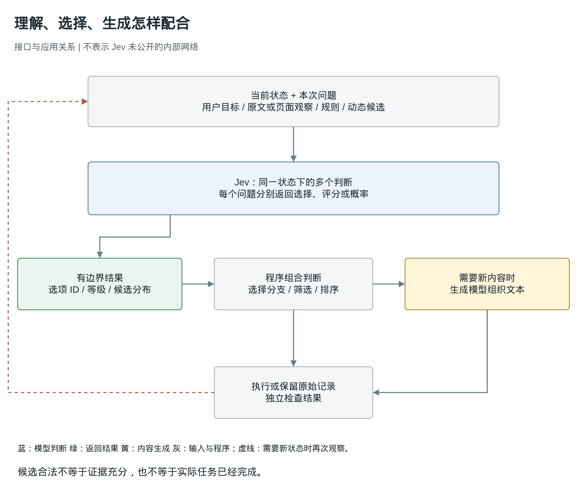
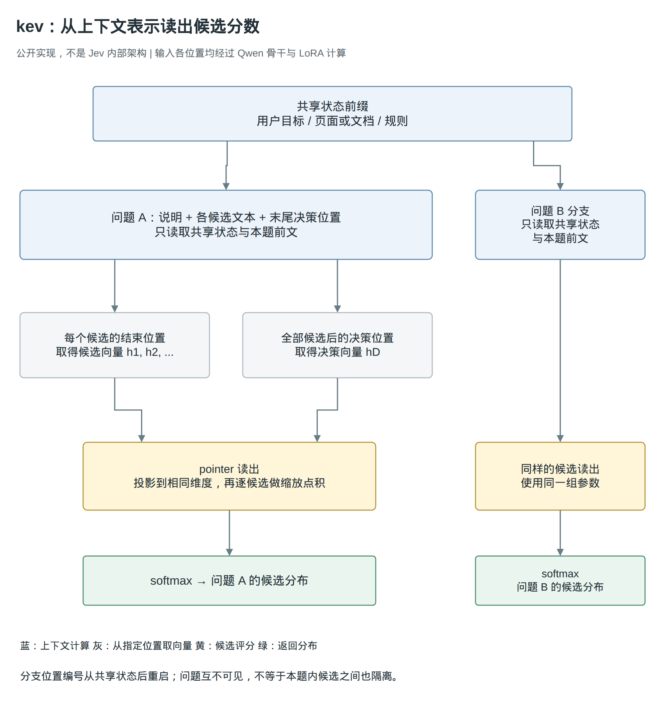
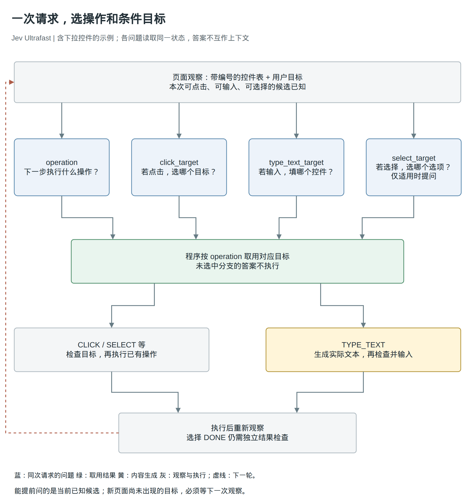

# Jev：解耦 LLM 的理解和生成

输入可以千变万化，下一步需要的答案，却常常已经在几个选项之中。

让一个浏览器助手查航班，它需要理解出发地、目的地、日期和你的偏好。但当页面已经列出几个输入框时，“下一步填哪里”并不需要一段新文字，只需要从现有控件里选一个。选好控件以后，“应该填什么”才可能需要生成。

Jev 关注的就是前一种工作：保留对语言和上下文的理解，让结果直接成为程序可以使用的判断。它把“当前应该做什么”的选择，与“需要创造什么内容”的生成分开，为软件提供另一种使用模型的方式。

资料截至 2026 年 9 月 20 日。本文依据官方文档、公开实现和第三方实验展开；实验数字来自对应作者报告，不是本文重新运行的结果。Jev 的内部架构尚未公开，下文会把官方能力与社区实现分别说明。

## 一、Jev 是什么：一个把上下文变成判断的模型

回到查航班这件事。程序已经拿到用户目标，也知道页面上哪些元素是按钮、哪些可以输入。现在要回答的是：“为了继续完成目标，应该对哪个控件做什么？”

调用生成模型当然也能解决这个问题。我们可以让它读页面、输出操作名和目标，再由程序执行。Jev 改变的不是“这件事是否需要理解”，而是理解之后的结果出口：调用方先说明本次允许的答案，模型返回其中的选择或相应概率，不生成解释、代码或一整段回复。[1][primitives][18][systemone]

**Jev 是 TypeSafe 提供的、面向软件的结构化决策模型。** 官方将它称为 System One model，强调快速、聚焦的判断。这是产品定位，不是已经得到证实的类脑架构；也不能由这个名字推导出它内部一定没有复杂计算。[18][systemone]

一次判断可以用三个部分理解：**状态告诉模型发生了什么，问题说明要判断什么，候选定义这次怎样回答。** 状态可以包含用户要求、页面内容、已有记录和适用规则；问题可以是选择下一步操作，也可以是判断一段材料是否支持某个结论。程序收到结果后，决定执行、继续收集信息，或者转向其他处理路径。[1][primitives]

例如，下面是一份教学用的输入，省略了实际接口字段：

```text
状态：用户要查苏黎世到伦敦的单程航班。
      页面上的出发地仍为 San Francisco，目的地为空。

问题：下一步应先修改哪个控件？

候选：origin      出发地输入框
      destination 目的地输入框
      trip_type   单程 / 往返开关
      none        现有信息不足以确定

返回：候选 ID，以及候选之间的概率分布。
```

这里最重要的不是把返回文本缩短到 `origin`，而是让这个结果直接指向程序已经知道的一个对象。程序不需要从“我认为应当先修改出发地”这句话里恢复动作意图，也不需要把模型临时编写的控件名称再猜测性地对应回页面。

不过，Jev 本身不是浏览器助手。它不负责发现页面元素，不直接点击，也不负责把城市名称写进输入框。当前官方接口接受文本、JSON 对象和文本数组，不原生接收图像、音频或视频。浏览器要先把页面整理成它能读的状态，执行和必要的文本生成则由外部程序完成。[3][ultrafast][18][systemone]



图 1：Jev 在应用中的位置。图中画的是已公开的接口与应用关系，不是内部神经网络；需要新信息时，程序重新观察，再发起下一轮判断。[1][primitives][2][fanout][3][ultrafast]

这就是标题里“解耦”的准确含义：**把语义判断与文本生成分开安排，而不是把一个已经发现的“理解模块”从 LLM 中拆下来。** 理解用户意图、比较候选、遵守规则，仍然需要模型计算；只是这些计算不必都以生成新内容结束。

## 二、特点是什么：动态定义、有限作答、集中判断

### 候选可以随请求改变，任务不必固定在训练时

一个只识别固定意图的分类器，可以把请求分到“查航班”“改地址”“查订单”。但知道用户要查航班，并不能直接回答当前页面应该点哪个控件。页面变了，可操作的对象也会变。

Jev 允许调用方在本次请求里提供问题、候选 ID 和自然语言描述。模型要结合这些描述与状态判断，而不是始终对着一份永久固定的标签表。当前页面可以选控件，下一次请求可以选工具，再下一次可以判断几段证据中哪一段更相关。[1][primitives]

“输入开放、输出有限”由此变得具体。开放的是用户表达、规则组合、文档内容和候选含义，不能在设计系统时逐一穷举；有限的是**这一次**允许返回的结果。输入仍然受上下文长度限制，候选也需要由程序提供，不是模型在后台自己寻找了所有可能答案。

因此，把 Jev 理解为一种通用的、条件化的分类或决策方式是成立的；把它理解为一个只能完成固定标签任务的分类器，就过窄了。反过来，动态标签也不是 Jev 独有的能力。能读取标签描述的分类模型、语言模型的候选评分，同样可以做这类事。区别最终要落到任务质量、多问题组织和实际效率上，不能仅靠“生成模型”与“决策模型”的名字划线。[10][simple][14][jeff]

### 三种结果，对应三种不同的问题

程序有时需要选一个，有时需要打等级，还有时需要判断一项陈述是否成立。Jev 用 Choice、Score 和 Noul 表达这三种需求。[1][primitives]

**Choice 解决候选之间的选择。** 比如从当前可操作控件中选出出发地输入框。返回值包括所选候选和候选分布，程序可以把选择映射回实际对象。

**Score 解决沿明确标准的分级。** 比如将一段材料对问题的支持程度定义为“不支持”“部分支持”“充分支持”。它返回分布及数值评分，评分可以落在相邻等级之间。这个数表示材料在等级上的位置，不是“本次判断有多少概率正确”。

**Noul 解决一项陈述为真的可能性。** 比如“材料是否明确提供了可下载的实现”。接近 1 表示倾向于真，接近 0 表示倾向于假，0.5 表示对真假同样不确定，而不是“提供了一半实现”。[1][primitives]

题型会影响结果的含义。Choice 问“哪一段最相关”，即使所有段落都不相关，也可能存在一个相对最接近的候选；逐段问 Noul“它是否提供回答所需的证据”，则允许所有段落都得到很低的支持概率。如果任务需要拒选，应在候选里明确提供“以上都不是”或“证据不足”，而不是希望模型自行突破结果类型。[17][jaggedness]

Choice 和 Score 还返回 `confidence`。官方将它解释为从概率分布计算出的统计量：分布越集中，模型越明确偏向某个结果；分布越平坦，区分候选的把握越低。它不是在候选分布之外，另有一个模型对“这次是否正确”进行了验证，也不能直接当作最大候选概率。Noul 没有这个独立字段。[20][confidence]

这一设计让程序能够观察模型的犹豫，但“有没有犹豫”和“有没有答错”仍是两件事。后面的评测会看到，模型确实可能分布很集中，却选择错误。

### 多个问题共享状态，答案由程序组合

假设一篇文章要检查三个条件：是否讨论 Agent 的执行机制、是否有公开代码、是否有对照实验。三个问题都需要读原文，但彼此不必依赖对方的答案。

Jev 可以在一个请求里接收多个问题，让它们共享同一份状态，并按各自的定义返回结果。这里的独立，首先是问题之间的信息关系：后一个问题不以先一个问题的答案为推理步骤。哪些条件决定保留文章、哪些只用于标记，交给程序明确组合。[1][primitives]

这不仅适用于几个互不相干的问题，也适用于**当前已能定义的条件分支**。浏览器可以同时问“下一步做什么”和“假如要输入，填哪个控件”。如果最后选择点击，就忽略输入目标；如果选择输入，就直接使用对应结果。官方称之为 speculative fan-out，即提前展开可能需要的判断。[2][fanout]

减少等待的原因在这里：条件目标原本要等操作类型返回后再问，现在两者基于相同的已知状态一起问，一次网络往返就能拿到答案。代价是可能算出一些不会被使用的分支，是否合算取决于批量判断的开销。

它不能消除真正的信息依赖。点击以后才出现的新菜单，在当前状态里还不存在；如果下一步必须阅读新菜单，就仍需执行、观察，再判断。集中提问改变的是调用组织，不是让模型提前获得未来信息。[1][primitives][2][fanout]

### 有限答案，使一类错误无法表达

如果程序只提供三个真实的文档 ID，遵守接口约束的结果就不能凭空返回第四个。如果只允许 CLICK、TYPE_TEXT、DONE 等操作，也不必再解析一个临时编造的操作名。这是限制输出集合带来的直接收益。[1][primitives]

但选中真实文档，不等于文档支持结论；选中真实按钮，也不等于它符合用户目标。有限输出压缩了可以表达的错误形式，没有消除理解和判断的错误。

这个区别也解释了 Jev 的能力边界。一个只有“是”和“否”的题目，仍可能需要很长的推理。答案空间小，不代表求解过程简单。官方把 Jev 定位于快速、聚焦判断，并在 Jev 1.13 的局限说明中列出计数、精确算术、日期比较和复杂间接关系等弱项。可以直接计算的量，仍应交给程序计算，不需要为了使用判断模型把它们重新变成语义问题。[17][jaggedness][18][systemone]

## 三、方法是什么：理解输入以后，怎样直接读出选择

### 不写答案，不等于不运行语言模型

要回答“这种模型怎么做”，先拆开两个经常被混在一起的过程：**处理输入**，以及**逐步生成输出**。

语言模型读完状态、问题和候选后，会得到一组包含上下文信息的内部表示。普通生成路径用这些表示预测下一个 token，再把生成的 token 接回上下文，继续预测后面的内容。如果任务只需要在几个候选里选择，就可以在读完输入以后直接取出候选分数，不再生成后续答案文本。[10][simple]

这给出了同类模型的一条可实现路径，却还不是 Jev 内部架构的解密。官方公开的是状态、问题、结果类型、多问题语义，以及名为 RLCD 的训练方向；没有在这些材料中给出足以重建模型的网络、数据和训练配方。下面用开源实现说明，已经有哪些办法能把这种接口变成真实计算。[1][primitives][19][primer]

### 第一种办法：从现成语言模型读取候选 token 的分数

假设把三个控件标成 A、B、C，并在输入中解释每个字母对应什么。模型处理完问题后，本来就需要预测“下一个 token 是什么”。如果读取 A、B、C 对应的分数，就已经拿到了对这三个候选的相对偏好。

simple-jev 正是这样使用现成开源语言模型的。它使用模型原有的聊天模板组织输入，读取允许答案 token 的 logits，也就是归一化之前的分数，再在这些候选之间转换为概率分布。选中的 ID 和最终 JSON 都由程序构造，不让模型把 JSON 一字一字写出来。[10][simple]

这个计算发生在 prefill 之后。Prefill 是对输入序列的处理，它本身就能产出下一个 token 的 logits；因此，这条路线不需要先生成一个答案，再把答案取回来评分，也不需要额外运行一段自回归解码循环。[10][simple]

这里省掉了什么，取决于原来的对照。如果原方案会生成一段解释和一整份 JSON，那么它确实跳过了这段输出的逐 token 计算和解析；如果原方案本来只输出一个 A，两边已经共享了大部分计算，不能仅凭“没有生成”推出巨大的速度优势。

同一份输入要回答多题时，还有一块可省的重复工作。simple-jev 先找出各题分词后完全相同的前缀，只处理一次，然后保存注意力计算需要的键和值，即 KV cache。每道题在这份缓存上继续处理自己的后缀，再读取自己的答案分数；不同问题不把彼此的答案接入上下文。[10][simple]

这不是把原文压成一句万能摘要。每个问题仍然要读取共享缓存，并计算自己的问题和候选；缓存复制、批次填充也需要时间。实现复用的是相同前缀的已有计算，不是承诺新增问题免费。

这条路线的意义在于：**不必先训练一个新模型，已经可以实验“理解之后直接选择”。** 它的限制也来自原有模型：模型是否懂问题、答案字母怎样分词、提示方式是否适合，都影响结果。当前项目要求每个答案标识能用一个可区分的 token 表示；可选的 RFDT 适配用来进一步训练判断，但不是这条推理路径成立的前提。[10][simple]

### 第二种办法：不经答案字母，直接比较问题与候选表示

答案字母是一种方便的桥接方法，但 A、B、C 本身没有业务含义。另一种做法，是直接从输入中取得候选的上下文表示，为本次候选计算分数。kev 展示了这条公开路线：以 Qwen 为骨干，加入少量可训练的 LoRA 适配参数，以及一个专用的 pointer 读出头。[11][kev][12][kev-model]

可以先把一题的输入想成下面的顺序。这里的边界标记是示意，不是要求应用照抄的提示词：

```text
共享状态

问题：下一步应修改哪个控件？
  <候选> origin：出发地输入框 </候选>
  <候选> destination：目的地输入框 </候选>
  <候选> none：没有合适目标 </候选>
<决策位置>
```

骨干运行以后，每个位置都有自己的上下文向量。kev 从每个候选的**结束标记**取出一个向量，再从最后的**决策位置**取出另一个向量。[12][kev-model]

为什么不是从候选开头取？在这种因果读取顺序下，开头还没有读到后面的候选说明；结束位置则已经看过该候选的完整文本，以及允许读取的前文。为什么另设决策位置？因为它排在全部候选之后，能在看完本题所有候选后形成用于比较的表示。这两个位置分别承担“这个候选是什么”和“这道题应怎样选择”的信息汇集作用。

读出头随后将决策向量和候选向量投影到相同维度，逐候选做缩放点积，得到分数，再通过 softmax 转成总和为 1 的候选概率分布。可以把它理解成：**用模型读完问题后形成的查询，去比较模型读完各候选后形成的表示。** 这里比较的是经过上下文计算和任务适配的向量，不只是把原始句子做一次词面相似度检索。[12][kev-model]

这种读出为什么支持动态候选？因为参与评分的是本次输入提供的候选向量。新页面增加一个按钮，就增加一个可评分的向量，不需要给网络永久增设一个名为“某网页第三个按钮”的输出类别。它也不需要先把候选映射到整个词表中的一个答案字母。[12][kev-model]

### 共享状态与问题隔离，怎样同时成立

如果将几道题简单拼成一条普通的因果序列，后面的题就能读取前面的题。这样虽然只放了一份状态，却改变了题目之间的信息关系：添加一道无关题，也可能改变另一道题看到的内容。

kev 用分支注意力限制解决这个问题。共享状态先形成公共前缀；每个问题分支只允许读取这个前缀和本题已经出现的位置，不允许读取其他问题分支。各分支的位置编号也从共享状态之后重新开始，而不是让第二道题因为排在后面就平移到另一段位置。[12][kev-model]



图 2：公开实现 kev 的计算方法。每个输入位置仍需经过骨干各层；图中展开问题 A 的读出细节，问题 B 使用相同参数。问题之间隔离，不代表同一道题内部的候选排列天然无关。[12][kev-model]

这个设计同时保留了两件事：多个问题使用同一份状态计算，问题又不会把其他题当成自己的前文。若完全分开执行，可以获得信息隔离，但会重复处理状态；若直接拼接、没有分支限制，则失去这种隔离。这是注意力结构影响行为和计算组织的具体位置。

还要区分“问题隔离”和“候选隔离”。在 kev 的默认排列里，同一道题后面的候选仍可读取前面的候选。代码另有候选隔离选项，但不能仅由上图的两题分支推导出“调换候选顺序一定不改变结果”。[12][kev-model]

专用读出头也不会凭空产生判断能力。kev 以有标签的问题训练读出头和 LoRA，用交叉熵推动正确候选获得更高概率；LoRA 让骨干的部分表示计算适应判断任务，而不必更新全部基础权重。骨干本身不再挂接用于生成文本的词表输出头，但仍然需要计算状态、问题和候选。这说明“没有输出生成”与“没有语言模型计算”相差很远。[12][kev-model][13][kev-train]

### 与“小模型加分类器”的区别，不在分类头这个名字

前两种办法已经说明，候选评分可以保留词表输出头，也可以换成专用读出。还有更小的路线：jeff 使用 400M 参数的 GLiFormer 编码模型，提供与 Jev 相近的判断接口。应用不用因为模型较小就放弃自然语言问题或多种结果类型。[14][jeff]

真正需要比较的是三个层面。第一，模型能否读懂当前任务需要的上下文与规则；第二，读出方式能否表达动态候选及相应概率；第三，多问题服务如何复用输入，是否保持所需的信息隔离。小模型可以实现接口和评分，但这些实现本身不能补齐复杂阅读、规则组合或知识上的能力差距。

例如，jeff 默认让 Choice 和 Score 问题共享一次编码，问题之间可能相互影响；要隔离所有问题，需要额外计算。simple-jev 将最大候选概率作为 confidence，而 Jev 的官方字段是对分布形状的统计。看似相同的返回字段，背后可能是不同的计算与语义。[10][simple][14][jeff][20][confidence]

因此，目前不能把 Jev 与小模型的差距归因于“多了世界知识”，也不能断言它只是换了一个分类头。Jev 的内部参数规模和完整训练细节在本文所读材料中没有披露。官方把 RLCD 展开为 Reinforcement learning for calibrated decisions，说明目标是产生判断及经过校准的概率，但没有给出可复现的奖励构造、优化过程和数据配方。[19][primer]

我们已经能够用开源代码解释并实现许多相近特点，却还不能声称这些代码就是 Jev 的实现方法。理解这个界限以后，方法部分就不必停在“黑盒所以什么都不知道”，也不必用一个社区方案填补所有未知。

## 四、能做什么：把有限判断放进完整工作流

### CUA：先让选择对应到真实界面

Computer Use Agent，简称 CUA，需要把用户目标转成连续的界面操作。在浏览器里，一次操作是否成功，不只取决于模型有没有理解目标，也取决于模型选的对象能不能对应到真实控件。

browser-use 的 jev-ultrafast 从常见 HTML 控件和 ARIA 无障碍标记获取类型、名称、当前值等信息，整理成带编号的元素表，同时保留到 DOM 真实节点的引用。默认决策循环读取的是这份结构化观察，不是截图；演示里的截图标记用来展示执行过程。[3][ultrafast]

由此，前面使用的“候选”在应用里有了来源。程序把当前可输入的控件作为输入目标候选，把可点击的控件作为点击目标候选。Jev 返回某个编号以后，执行器将它解析回本轮已经观察到的节点，检查目标仍然有效，再执行操作。[3][ultrafast]

这一步不能只靠模型约束来替代。候选集合的有效性首先来自观察器：漏掉的按钮不会成为可选目标，页面更新也可能使旧节点失效。该项目尚未覆盖 shadow roots、frames、canvas 等情况，因此它展示的是结构化网页操作，而不是所有桌面界面的通用视觉操作。[3][ultrafast]

### 一次请求，既选操作，也准备条件目标

在当前页面里，程序已经知道哪些控件支持点击、输入或下拉选择。于是，它可以把以下问题放进一次 Jev 请求：下一步执行什么操作；如果点击，点哪里；如果输入，填哪里；有相应控件时，如果进行下拉选择，选哪个目标。[3][ultrafast]

这些问题不用相互读取答案，因为“如果点击”和“如果输入”已经写进各自的问题。返回以后，程序按操作类型取用匹配的目标，其余答案不会执行。若目标还要等新页面出现后才能知道，就留到下一轮。[2][fanout][3][ultrafast]



图 3：Jev Ultrafast 的操作循环。它将可以基于当前观察判断的分支提前提问，却没有省略操作后的观察，也没有让 Jev 生成需要输入的文字。[2][fanout][3][ultrafast]

选中目的地输入框，只解决了“填哪里”。项目在 TYPE_TEXT 分支调用文本生成模型，依据目标和状态生成实际内容，随后再输入。点击、选择等已有操作则不需要先生成一段文字。演示中的城市名称是实际生成的，不是预先写死的字符串。[3][ultrafast][4][performance]

由此形成完整循环：页面观察产生真实目标候选，Jev 返回操作和目标，程序仅取用被选中的分支，必要时生成内容，执行后取得新状态。每一轮判断都重新建立在当前页面上。

完成条件也在这条关系中。模型选择 DONE，只表示它认为已经结束；航班演示另行检查出发地、目的地、日期、单程设置和结果是否出现。不能因为 DONE 是一个合法候选，就把它当成任务完成的外部证据。[4][performance]

### 材料筛选：选择记录，保留原文

把页面控件换成文档记录，同样的模式也可以用于信息处理。jgrep 允许用自然语言描述条件，判断输入的行、段落或代码单元，并输出匹配的原始内容，而不是重新写一份摘要。[5][jgrep]

比如在研究材料里分别检查“是否解释执行机制”“是否提供可检查代码”“是否有同题对照实验”，再由程序保留符合条件的原文及来源。这是对其能力的一种应用推导。多个条件不必挤成一个模糊总分，也不必让模型决定所有编辑偏好。

这里的好处是，判断结果附着在原记录上。后续写作还能回到原文核查，而不是只剩一段已经丢失证据关系的摘要。不过，筛选器只看得到交给它的材料。搜索漏掉的内容、没有取回的正文，不能靠改进判断模型补回来。发现、获取、筛选和写作仍是不同的工作。

### 证据判断：在生成前后检查不同的问题

检索增强生成，即 RAG，通常先找材料，再让模型根据材料回答。TypeSafe 的官方示例在两者之间加了一层 Jev 判断：对于每一对“用户问题与检索段落”，同时问是否相关、是否包含回答证据、是否反驳问题前提，以及是否含有提示注入内容。[9][rag]

这四个问题不是四种互斥标签。一段文字可能既有回答证据，又在反驳问题的假设。程序先排除识别出的注入内容，再保留冲突证据，随后按普通证据条件筛选其余材料。生成模型会分别看到普通证据和冲突证据，而不是把所有检索段落混在一起。[9][rag]

为什么“反驳前提”值得单独处理？因为用户可能问“这个功能为什么默认开启”，原文却说根本没有这个功能。若筛选标准只寻找顺着问题回答的段落，就可能漏掉最需要呈现的事实。把前提冲突作为独立判断，可以让生成步骤有机会先纠正问题，而不是继续补全错误假设。

这个示例使用 Jev 1.12，于 2026 年 8 月 27 日记录结果：六个用户查询，每个从 81 段语料中检索 12 段，再对每个查询与段落组合问上述四个 Noul 问题。它展示了可检查的处理流程，还不是大规模幻觉评测。[9][rag]

生成以后还可以检查另一件事：**答案中的引用，是否真的支持它所附着的陈述。** 官方的 citation-check 示例实现了这条路径。[21][citationcheck]

它先用代码检查直接引文能否在原文中找到，统一引号和空白后仍找不到，就不必让模型猜测引文是否存在。引文存在时，再把所在章节与待验证陈述交给 Jev，由 Choice 在“支持”“反驳”“没有涉及”中选择；只注明章节而没有逐字引文的引用，则直接进入语义判断。[21][citationcheck]

前一层检查文本是否存在，后一层检查文本的含义。一个真实句子也可能被用于证明原文没有说过的结论，仅通过字符串匹配无法识别这种错误。反过来，模型也不需要接手代码已经能精确检查的引文定位。

示例用 Jev 1.12 在 2026 年 8 月 16 日检查了八条引用：四条准确引用被判为支持；一条不存在的引文由代码拦下；一条与原文相反的陈述被判为反驳；两条不受支持的陈述得到较低 confidence，进入人工确认。这里的人工阈值 0.8 是示例设置，不是跨任务适用的安全值。逐字检查也会把截短或改写的引文判为不匹配，不能直接用来否定正常转述。[21][citationcheck]

这些应用共同利用的不是“Jev 会写更好的回答”，而是它能对已有状态提出一组边界明确的问题，让生成步骤使用经过区分的材料，或让程序检查生成结果。这可以针对某些幻觉路径设置检查，但检查器自身是否可靠，仍需看下面的效果证据。

## 五、效果怎么样：效率、判断质量与可信度分别看

### 多问题是否比连续调用更划算

前面的条件分支模式有一个实际前提：提前问一些可能用不上的问题，其额外成本不能抵消减少往返的收益。willkelly/jev-evaluation 在 2026 年 9 月 19 日测试了 Jev 1.13.0 的多问题表现，每个数量条件运行 300 次。批次包含一个括号嵌套合法性问题和其他填充问题，以下是 E3 汇总中的三个条件。[6][evaluation][7][e3]

| 每次请求的问题数 | 平均输入 token | 请求延迟中位数 |
| --- | ---: | ---: |
| 1 | 3,667 | 132 毫秒 |
| 16 | 5,005 | 177 毫秒 |
| 255 | 26,523 | 387 毫秒 |

从 1 题增加到 16 题，整次请求中位延迟增加了 45 毫秒，而不是乘以 16。这个结果支持集中判断能够摊薄单题的服务开销。但从 1 题到 255 题，输入量仍约增加到 7.23 倍，延迟约增加到 2.94 倍；它不是无限免费扩题，也不能用于推算任意长度、任意难度任务的固定速度。[7][e3]

同一组实验还比较了 3,000 个问题合并请求和分别请求的答案。准确率分别约为 97.77% 和 97.80%，有 5 个问题的离散答案改变。在这一样本上，合并没有表现出明显的准确率损失；但这不等于服务在不同请求组织下逐次返回完全相同的数值。仓库提供实验代码和汇总，未公开全部逐请求日志，这里采用作者报告的结论范围。[6][evaluation][7][e3]

这些数据验证的是外部行为，不能反向证明 Jev 内部就使用了 kev 的注意力分支。不同实现可以表现出相似的批量延迟曲线，内部结构仍需独立证据。

### 从毫秒级判断到完整浏览器任务

Jev Ultrafast 的航班演示记录了 7.073 秒的运行，其中有 17 次 Jev 请求、两次文本生成，以及浏览器操作和页面等待；Jev 请求的中位延迟是 178 毫秒。计时从初始页面观察后的第一次预测开始，到接受 DONE 为止，不包括浏览器启动、初始导航和结束后的独立复核。[4][performance]

这说明快速选择可以进入连续交互，但不能把 178 毫秒直接当成一步操作的全部时间。页面读取、候选更新、实际点击和加载都在影响完整任务。

项目还用相同 Jev 与文本模型做了三对运行框架对照。六次运行均通过独立结果检查，中位任务时间从 9.450 秒降为 7.092 秒，约降低 25%；浏览器协议调用的中位数从 1,092 次降到 101 次，Jev 请求从 22 次降到 17 次。[4][performance]

这次改善来自观察与执行方式：集中读取页面快照，减少逐节点调用；避免把无关动画都视为决策失效；等待组合框建议出现，再选择真实可用的候选。它说明的是**同一个快速模型，在减少重复观察和无效重试后，整项任务还能缩短**，不是“Jev 比另一个 LLM 快 25%”。三对单任务运行也不能给出通用 CUA 成功率。[4][performance]

### 与其他判断模型同题比较，优势有多大

一个 Jev 1.13.0 与 GLiNER2.5 的公开实验，从新闻主题、客服意图和情绪分类数据中，各抽取 100 条近似类别均衡样本，比较相同输入上的准确率。这个尺度适合观察差异，不足以代表所有语言判断。[8][btzsc]

| 任务切片 | GLiNER2.5 | Jev |
| --- | ---: | ---: |
| 新闻主题，AG News | 70% | 91% |
| 客服意图，Banking77/BTZSC | 61% | 87% |
| 情绪分类，DAIR Emotion | 44% | 48% |

Jev 在前两个切片的优势明显，情绪分类的差异区间则仍跨过零，没有给出明确的优势证据。客服意图实验实际使用 72 个候选，并排除了范围外样本，不能据此判断“没有合适候选时能否拒选”。硬件和服务条件也不同，不宜把延迟差解释成仅由架构导致。[8][btzsc]

开源路线走到哪一步，可以看 kev 作者的另一组同题实验。在 transfer-v4 开发集的 764 条记录上，作者同时测试了未适配的 Qwen3-8B、专用 kev 和 Jev。这些记录来自 kev 没有用于适配训练的公开来源与保留规则结构，涉及知识、句意、情绪和规则判断。[11][kev]

| 模型或方法 | 准确率 | Brier 分数，越低越好 |
| --- | ---: | ---: |
| Qwen3-8B 基座，直接读取答案 token 分数 | 72.6% | 0.366 |
| kev-4B | 79.0% | 0.328 |
| kev-8B | 79.6% | 0.337 |
| Jev | 85.7% | 0.211 |

Brier 计算预测分布与真实标签之间的平方误差。它同时受到选择是否正确、概率怎样分配的影响，不是纯粹的校准指标。这里 Jev 在两项上领先，kev 已能完成相当一部分同类判断，但还没有达到同等水平。[11][kev]

把同一个 8B 基座放进比较很重要：总准确率从 72.6% 到 79.6%，说明这一套适配和读出在该开发集上有收益；但知识切片 MMLU 从 75% 降到 70%，句意切片 PAWS 从 84% 降到 78%。总分进步与部分原有能力损失可以同时发生，不能把专用化写成没有代价的增强，也不能仅由总分分离出分类头与训练各自的贡献。[11][kev]

这仍然是参与模型选择的开发集结果，不是完全未接触的最终测试。Jev 是否见过相关公开数据未知，kev 的 4B、8B 也是研究预览。它们提供了有价值的开源实验，而不是已经证明等价的 Jev 复刻。[11][kev]

更小的 jeff 在所报告的 JevBench 220 道困难题上为 37.7%，Jev 为 74.1%。题目包含长规则、多步关联和时间数值判断，差距不能直接外推到简单路由。mini-jev 则用冻结量化的 Qwen 模型做候选 token 评分，在自建日文题集上报告 2,238/2,400，即 93.25%；题目不同，不能把这个更高的数字排在 Jev 前面，其当前多问题执行也没有共享前缀。[15][jeff-results][16][mini]

由此能回答“小模型加分类器有什么区别”了：接口层面可以做得很像，动态候选也可以实现；在这些公开任务中，困难语言判断仍有明显差距。世界知识是部分任务需要的能力，但阅读理解、规则组合、适配造成的能力变化同样重要。现有对比没有隔离这些变量，不能把 Jev 的优势归结为一个已知原因。

### 幻觉少了哪一类，又留下了什么

有限输出直接减少的是候选外的编造：程序给定的操作名、控件 ID、文档 ID，不再由模型自由创造。但无依据判断仍然可以发生，而且完全符合返回类型。

例如，输入只说“用户询问物流”，候选却只有“已发货”“未发货”。模型无论选哪项都合法，但两项都没有证据。这是教学例子。加入“未说明”让正确的拒选可以表达；模型能否真正选中它，则取决于缺信息情况下的判断能力，不能由候选定义保证。

概率也需要这样区分。在前面的情绪分类实验里，Jev 的准确率为 48%，所选标签的平均概率却约为 0.819，校准误差 ECE 为 0.351；GLiNER2.5 的 ECE 为 0.117。ECE 比较不同概率区间中，模型给出的把握与实际答对频率是否接近，越低越好。这说明在该切片上，Jev 不仅会错，还可能高估自己的正确程度。[8][btzsc]

注意，这里的 0.819 是所选标签概率，不是 Jev 另行返回的 confidence。后者汇总的是分布集中程度，也不能自行修正概率失准。一个集中了大部分概率的错误答案，仍可能有很高 confidence；官方文档中的阈值示例不能替代实际任务的校准检查。[20][confidence]

jev-evaluation 的 Choice 工单测试还观察到：删去必要信息会使 confidence 下降，但语法通顺、由虚构词语组成的内容未必同样触发下降；其他题型的反应也不相同。另一项测试在 200 条工单中加入声称“主管已经决定”的诱导文字，147 条答案改变。返回值的形式仍然正确，决策依据却受到了不该成为授权的输入影响。[6][evaluation]

这不是说分类错误、无依据断言和提示注入都是同一种“幻觉”。它们对应不同的失败原因：可能是读错了已有证据，可能是没有证据仍作答，也可能是将不可信内容当成了指令。官方局限文档也明确提到对抗内容与无关上下文的影响。限制输出集合，没有自动隔离输入里的这些影响。[17][jaggedness]

因此，前面 RAG 与引用核查的价值，应理解为增加了**可分别检查的环节**：检索段落是否支持回答，陈述是否被引用支撑，缺证据时是否拒选。八条引用示例展示了这条路径能运行，没有给出通用的“幻觉下降率”，更不能声称 Jev 模型独自检出了所有错误，因为其中一项由代码发现，两项还进入人工确认。[21][citationcheck]

综合这些公开材料，Jev 是一个面向软件的、有边界输出的语义决策模型；动态候选、多问题和概率信息，使它可以参与浏览器操作、材料筛选与证据核对；现成语言模型读分数、专用候选读出和小编码模型，都已提供部分可检查的开源方法。公开实验显示了批量效率和部分任务的质量优势，也显示了任务差异、校准不足和上下文干扰。

**需要理解，不一定需要生成；不再生成，也不等于已经正确。** Jev 最值得关注的变化，是把原来混在一次文本回答中的几件事分开：模型负责语义选择，生成模型负责新内容，程序负责确定性计算和执行，证据与环境反馈负责检查结果。读懂这种分工，才既能看到它能做什么，也能知道什么时候不能只相信一个合法的答案。

## 原文与实现

1. [TypeSafe：Primitives][primitives]。问题类型、结果含义、多问题与依赖边界。
2. [TypeSafe：Speculative fan-out][fanout]。提前询问条件分支，再由程序取用结果。
3. [browser-use/jev-ultrafast：README][ultrafast]。结构化页面观察、动态目标、生成与执行循环。
4. [Jev Ultrafast：Performance][performance]。航班演示、同模型对照、计时范围与限制。
5. [keltokhy/jgrep][jgrep]。自然语言筛选及原始记录保留。
6. [willkelly/jev-evaluation][evaluation]。2026 年 9 月 19 日实验、校准与对抗输入观察。
7. [Jev evaluation：E3 汇总][e3]。问题数、输入量、延迟及合并请求的答案变化。
8. [BTZSC pilot v1：Jev vs GLiNER2.5][btzsc]。同题准确率、概率质量、采样与范围外限制。
9. [TypeSafe：Classifying RAG passages][rag]。四种段落判断、六个查询，Jev 1.12 示例。
10. [featherless-ai/simple-jev][simple]。Prefill 读分数、共享前缀与可选 RFDT。
11. [jaredpalmer/kev：README][kev]。模型方法、同题结果、任务差异与预览状态。
12. [kev/model.py][kev-model]。候选末尾读出、决策位置、分支注意力与 pointer 计算。
13. [kev/train.py][kev-train]。LoRA 与读出头的监督适配。
14. [jeff：实现与行为差异][jeff]。编码模型、多问题隔离和返回语义。
15. [jeff：测试结果][jeff-results]。任务切片及 JevBench 困难题比较。
16. [UpHash-Network/mini-jev][mini]。冻结模型评分与自建日文实验。
17. [TypeSafe：Jev 1.13 jaggedness][jaggedness]。2026 年 9 月 17 日复核的模型局限。
18. [TypeSafe：System One][systemone]。定位、文本输入范围及生成边界。
19. [TypeSafe：AI primer][primer]。RLCD 的名称与目标，不包含可复现配方。
20. [TypeSafe：Confidence][confidence]。分布统计与阈值含义；页面演示公式仅为近似。
21. [TypeSafe：Double-checking citations][citationcheck]。代码查引文、模型查支持关系，Jev 1.12 示例。

[primitives]: https://docs.typesafe.ai/primitives
[fanout]: https://docs.typesafe.ai/patterns/fan-out
[ultrafast]: https://github.com/browser-use/jev-ultrafast/blob/1231850a0bf1a0c0341fe408ef1668dbbfdfac46/README.md
[performance]: https://github.com/browser-use/jev-ultrafast/blob/1231850a0bf1a0c0341fe408ef1668dbbfdfac46/docs/performance.md
[jgrep]: https://github.com/keltokhy/jgrep/blob/bc0dc8ddb63f9ae940490d436123775d08217b6b/README.md
[evaluation]: https://github.com/willkelly/jev-evaluation/blob/534c837b017fe670c5b70a558604dee171dc88b1/README.md
[e3]: https://github.com/willkelly/jev-evaluation/blob/534c837b017fe670c5b70a558604dee171dc88b1/runs/full-20260919/e3_result.json
[btzsc]: https://github.com/AbdelStark/jev-benchmarks/blob/0d610cc53e79bcbec691312b0c4adb4a0e371642/results/reports/btzsc-pilot-v1.md
[rag]: https://docs.typesafe.ai/cookbooks/classifying_rag_passages
[simple]: https://github.com/featherless-ai/simple-jev/blob/0dd5396ffce671ab7c4bfc031506d8e558cf8d23/README.md
[kev]: https://github.com/jaredpalmer/kev/blob/20fa6268c8ceb226530be2fb5266ab2c36b37724/README.md
[kev-model]: https://github.com/jaredpalmer/kev/blob/20fa6268c8ceb226530be2fb5266ab2c36b37724/kev/model.py
[kev-train]: https://github.com/jaredpalmer/kev/blob/20fa6268c8ceb226530be2fb5266ab2c36b37724/kev/train.py
[jeff]: https://github.com/logan-markewich/jeff/blob/34b32f99a727c47b679adde33f4702a001e02979/README.md
[jeff-results]: https://github.com/logan-markewich/jeff/blob/34b32f99a727c47b679adde33f4702a001e02979/bench/RESULTS.md
[mini]: https://github.com/UpHash-Network/mini-jev/blob/ec7e980ff6f35af4503892e61ef423ca9c74cbce/README.md
[jaggedness]: https://docs.typesafe.ai/model-jaggedness/jev-1.13
[systemone]: https://docs.typesafe.ai/concepts/system-one
[primer]: https://docs.typesafe.ai/introduction/machine-learning-primer
[confidence]: https://docs.typesafe.ai/confidence.md
[citationcheck]: https://docs.typesafe.ai/cookbooks/citation_check.md
